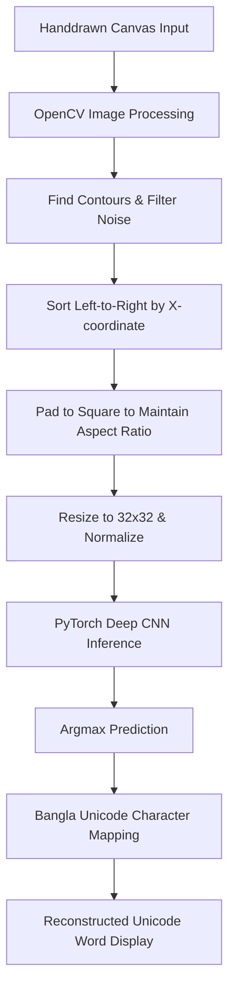

# Bangla Handwritten Word Recognition System

This repository implements a complete, containerized system for recognizing handwritten Bangla words. It combines classic computer vision techniques for horizontal character segmentation with a deep Convolutional Neural Network (CNN) for character classification.

The system is built with four primary technological pillars:

- **PyTorch** for deep learning model design, training, and GPU acceleration.
- **MLflow** for robust experiment tracking, hyperparameter logging, metric visualization, and model registry.
- **Streamlit** for an interactive, canvas-based web application that displays Unicode text recognition.
- **Docker** for containerizing the application to ensure repeatable and portable deployments.

---

## Problem Statement

Handwritten character recognition for the Bangla script is highly challenging due to:

- A complex alphabet comprising vowels, consonants, numerals, and an extensive set of compound conjunct characters.
- High structural variability in individual handwriting styles.
- Cursive and continuous strokes that connect adjacent characters.

This system approaches the problem by dividing handwritten word recognition into two key stages:

1. **Horizontal Word Segmentation:** A handwritten word drawn on a digital canvas is processed using OpenCV to identify individual character contours. Bounding boxes are filtered to remove noise, and sorted left-to-right to isolate the individual characters in sequence.
2. **Deep Learning Classification:** Each isolated character is preprocessed, resized to 32x32 pixels, and passed through a deep CNN built in PyTorch to classify it into one of the 84 target classes. The predicted class is then mapped to its corresponding Bangla Unicode character to reconstruct the written word sequence.

---

## Dataset Description

The system is trained on the **BanglaLekha-Isolated** dataset, a large-scale, public dataset of isolated handwritten Bangla characters.

### Dataset Statistics

- **Total Samples:** 166,105 handwritten character images.
- **Target Classes:** 84 distinct character classes.
- **Class Structure:**
  - **Classes 1 to 11:** Vowels (অ to ঔ)
  - **Classes 12 to 50:** Consonants (ক to ঁ)
  - **Classes 51 to 60:** Bangla Numerals (০ to ৯)
  - **Classes 61 to 84:** Compound Conjuncts (ক্ত to স্ত)

### Image Naming Convention

Each image file in the dataset follows a specific metadata-encoding naming convention:
`[District]_[Institution]_[Gender]_[Age]_[Date]_[FormID]_[ClassID].png`

For example, in `01_0001_0_08_0916_1990_1.png`:

- **First 2 digits (01):** District identifier from which the sample was collected.
- **Next 4 digits (0001):** Institution identifier.
- **Next 1 digit (0):** Gender of the subject (0 for male, 1 for female).
- **Next 2 digits (08):** Age of the subject.
- **Next 4 digits (0916):** Date of collection (September 16, 2016).
- **Next 4 digits (1990):** Serial number of the collection form.
- **Last 1 digit (1):** Character class of the sample (matches the directory name, 1 to 84).

---

## System Architecture & Complete Approach

The system employs a modular and clean pipeline designed to bridge low-level computer vision with modern deep learning. Below is the comprehensive technical breakdown of our approach:



### 1. Dataset Preparation & Data Splits
- **Source Directory Structure:** Raw data must be placed inside the `data/raw/Images/` folder, structured under sub-folders named `1` to `84` matching each character class.
- **Train/Validation Split:** To ensure rigorous and reproducible validation, `train.py` utilizes PyTorch's `random_split` to divide the dataset into an **80% training set** and a **20% validation set**. A fixed manual random seed (`123`) is set for the split generator to guarantee identical partitions across training runs.
- **Data Loaders:** PyTorch `DataLoader` instances manage batch creation with `batch_size = 64`, enabling parallel data fetching via multi-process workers (`num_workers = 2`).

### 2. Preprocessing Strategy
- **Training Preprocessing Pipeline:**
  - Raw images are read from disk.
  - Converted to **Grayscale** (1 channel) to strip out irrelevant color artifacts.
  - Resized exactly to **32x32 pixels** to match the model input layer.
  - Converted to `FloatTensor` using `torchvision.transforms.ToTensor()`, which automatically scales pixel values from `[0, 255]` to the `[0.0, 1.0]` range.
- **Interactive Canvas Preprocessing (Inference):**
  - Streamlit digital canvas sketches are captured as raw RGBA images.
  - Stripped of alpha channel and converted to 8-bit Grayscale.
  - Binarized using binary thresholding (`cv2.threshold` with threshold `1`) to cleanly separate white pen strokes on the black canvas background.
  - To prevent shape distortion and stretching, each segmented Region of Interest (ROI) is centered and zero-padded into a square format of size `max(width, height) x max(width, height)` before resizing to `32x32`.

### 3. Word Segmentation Strategy
Because input on the drawing board represents a complete word (sequence of characters), a robust classic vision horizontal segmentation is employed:
- **Contour Detection:** Using OpenCV's `cv2.findContours` (with `cv2.RETR_EXTERNAL` and `cv2.CHAIN_APPROX_SIMPLE`), the system locates isolated white stroke clusters.
- **Noise Filtering:** Tiny artifacts or accidental pen dots are filtered out by evaluating the contour area. Contours with an area strictly less than **20 pixels** are discarded as noise.
- **Chronological Sorting:** Standard contour discovery has no guaranteed horizontal order. The bounding boxes `(x, y, w, h)` are extracted and sorted ascendingly by the **left coordinate (x-value)**. Since Bangla is read and written left-to-right, this preserves the natural order of the handwritten characters.

### 4. PyTorch Model Architecture
We implement a custom Convolutional Neural Network (CNN) in PyTorch (`BanglaOCRModel`) designed to learn spatial representation patterns from small-resolution handwritten glyphs:

| Layer Type | Configuration | Output Shape | Details |
| :--- | :--- | :--- | :--- |
| **Input** | Grayscale Channel | `(1, 32, 32)` | Raw character pixel matrix |
| **Conv2D** | 32 filters, 3x3 kernel, pad 1 | `(32, 32, 32)` | Extracts low-level edges |
| **ReLU** | Element-wise activation | `(32, 32, 32)` | Introduces non-linearity |
| **MaxPool2D** | 2x2 kernel, stride 2 | `(32, 16, 16)` | Downsamples spatial size |
| **Conv2D** | 64 filters, 3x3 kernel, pad 1 | `(64, 16, 16)` | Extracts higher-level textures |
| **ReLU** | Element-wise activation | `(64, 16, 16)` | - |
| **MaxPool2D** | 2x2 kernel, stride 2 | `(64, 8, 8)` | Downsamples spatial size |
| **Flatten** | Reshape to vector | `(4096,)` | Flattens spatial map |
| **Linear (FC)**| Fully Connected Layer | `(128,)` | Learns global feature combinations |
| **ReLU** | Element-wise activation | `(128,)` | - |
| **Linear (FC)**| Fully Connected Output | `(84,)` | Final logits mapping to classes |

### 5. Training Process & Hyperparameters
- **Loss Function:** `nn.CrossEntropyLoss` is used to optimize the multi-class (84 targets) categorization task.
- **Optimizer:** `torch.optim.Adam` with a fixed learning rate of `0.001` (offering adaptive gradient updates and momentum).
- **Hyperparameters:**
  - `epochs = 5`
  - `batch_size = 64`
  - `image_size = (32, 32)`
- **Device Orchestration:** Dynamically selects `cuda` if an NVIDIA GPU is available; otherwise, falls back cleanly to the host `cpu`.
- **Training Iterations:** Batches are iterated, model gradients are zeroed out, forward passes are computed, losses are backpropagated, and optimizer weights are updated. Progress reports are printed in logs every **500 batches**.
- **Model Checkpoints:** Once training completes, model parameters are serialized to `models/model.pt` and a matching index-to-class folder registry is written to `labels.json`.

### 6. MLflow Tracking & Experimentation
Robust experiment tracking is fully integrated into the training loop using MLflow with a persistent SQLite database backend:
- **Tracking Database:** Run details are written to `sqlite:///mlflow.db` (enabling historical comparison and analysis of training runs).
- **Logged Parameters:**
  - `epochs` (e.g., `5`)
  - `batch_size` (e.g., `64`)
  - `img_size` (e.g., `32`)
  - `device` (e.g., `cuda` or `cpu`)
- **Logged Metrics:** Evaluated and recorded at the end of every epoch:
  - `train_loss`
  - `train_accuracy`
  - `val_loss`
  - `val_accuracy`
- **Model Registry:** The trained PyTorch model architecture and weights are registered natively in the MLflow store via `mlflow.pytorch.log_model(model, "model")`.

### 7. Bangla Unicode Character Mapping
To bridge PyTorch class indexes with human-readable textual output, the system implements a dictionary mapping. The predicted output index maps to its source BanglaLekha folder string (e.g., `"1"` through `"84"`). This is converted to the official Bangla Unicode glyph using a lookup map:
- **Folder "1"** $\rightarrow$ `"অ"` (Vowel)
- **Folder "12"** $\rightarrow$ `"ক"` (Consonant)
- **Folder "51"** $\rightarrow$ `"০"` (Numeral)
- **Folder "84"** $\rightarrow$ `"স্ত"` (Compound Conjunct)

---

## Installation & Local Setup

The project can be run using the modern, ultra-fast Python package manager **uv**, or standard **pip** and **virtualenv**.

### 1. Create & Synchronize the Environment

Clone this repository and choose one of the options below to prepare the virtual environment and install the required dependencies:

#### Option A: Using `uv` (Recommended - fast and simple)
```bash
# Automatically creates .venv and synchronizes all dependencies
uv sync
```

#### Option B: Using Standard Python & `pip`
```bash
# Create a standard virtual environment
python3 -m venv .venv

# Activate the virtual environment (Linux/macOS)
source .venv/bin/activate

# On Windows, activate with:
# .venv\Scripts\activate

# Install the dependencies
pip install --upgrade pip
pip install -r requirements.txt
```

### 2. Dataset Placement

Since the dataset is large, it should not be committed to Git. Create the target directory and place your extracted dataset there:

1. Extract your dataset zip file.
2. Place the folders numbered `1` through `84` inside the directory:
   `data/raw/Images/`
3. Verify that the path `data/raw/Images/1/` contains the `.png` images for class 1.

---

## Pipeline Execution

Always ensure your virtual environment is activated before running the pipeline commands if using the standard Python workflow:
```bash
source .venv/bin/activate
```

### 1. Run the Training Script

Launch the end-to-end PyTorch training pipeline:

#### Using `uv`:
```bash
uv run python train.py
```

#### Using Standard Python:
```bash
python train.py
```

During execution, validation accuracies and training losses will log to stdout. The final PyTorch model weights will save into `models/model.pt` and class index mappings write to `labels.json`.

### 2. Launch the MLflow UI

To view the logged runs, hyperparameter charts, and registered models, start the MLflow server:

#### Using `uv`:
```bash
uv run mlflow ui --host 127.0.0.1 --port 5000 &
```

#### Using Standard MLflow:
```bash
mlflow ui --host 127.0.0.1 --port 5000 &
```

Open your browser and navigate to `http://127.0.0.1:5000`. Switch the selected experiment from **Default** to **bangla-ocr** in the left sidebar to visualize and compare your training runs.

### 3. Start the Streamlit Web Application

Launch the Streamlit app to interactively test the model:

#### Using `uv`:
```bash
uv run streamlit run app.py
```

#### Using Standard Streamlit:
```bash
streamlit run app.py
```

This launches a web browser page where you can draw words on the digital canvas, segment them, and view real-time Unicode predictions.

---

## Streamlit Interactive Web Application

Launch the Streamlit interface to experience the full recognition pipeline.

### Interface Walkthrough
1. **Interactive Draw Canvas:** An HTML5 drawing canvas powered by `streamlit-drawable-canvas` allows you to write words directly with a cursor or stylus on a dark black board.
2. **Prediction Pipeline:** Clicking the **Predict** button triggers our OpenCV horizontal word segmentation.
3. **Contour Metrics:** The application displays each isolated character sequentially, along with a confidence metric (percentage score extracted via Softmax over the predicted model logits).
4. **Unicode Word Output:** The sequence of recognized characters is concatenated left-to-right and displayed as standard, copyable Bangla Unicode text.
5. **Model Card Sidebar:** Displays the CNN layer sequence, PyTorch version, and the number of active classes trained.

---

## Docker Containerization

To package the application and its dependencies into a portable, isolated environment:

### 1. Build the Docker Image

Build the container image using the supplied multi-layer `Dockerfile`:

```bash
sudo docker build -t bangla-ocr-app:0.1 .
```

### 2. Run the Container

Run the Streamlit application container. The container exposes port `8501`:

```bash
sudo docker run -p 8501:8501 bangla-ocr-app:0.1
```

Open your browser and go to `http://localhost:8501` to use the application.

*Note: If port 8501 is already in use by a local Streamlit server on your host machine, you can map the container to a different host port (such as 8502) instead:*

```bash
sudo docker run -p 8502:8501 bangla-ocr-app:0.1
```

*Access this version in your browser at `http://localhost:8502`.*

---

## Limitations & Possible Improvements

### Current Limitations
- **Connected Characters / Cursive Writing:** The classic computer vision bounding box approach relies entirely on white spaces separating characters. If a user writes adjacent characters connected (continuous line strokes) or overlapping, OpenCV reads them as a single contour, causing the model to receive a merged glyph and fail.
- **Limited Lexicon & Vocabulary:** The system can only recognize characters present in the 84 classes of the BanglaLekha-Isolated dataset. Although it covers all primary vowels, consonants, digits, and 24 common conjuncts, complex or rare conjuncts (which exist in abundance in Bangla) are not yet classifiable.
- **Context-Agnostic Recognition:** The predictions are computed purely character-by-character. The system does not utilize contextual semantic language processing. A single misclassified character will break the spelling of the word since no spelling checker or word auto-correction dictionary is applied.

### Future Improvements
1. **Sequence-to-Sequence Modeling (CRNN & CTC Loss):** Transitioning to a Convolutional Recurrent Neural Network (CRNN) with Connectionist Temporal Classification (CTC) loss or a Vision Transformer (ViT) sequence encoder would allow the network to read full lines/words of text *without* requiring explicit, fragile character-level contours.
2. **Post-Processing Language Models:** Integrating an n-gram or a masked language model (such as a BERT-based model fine-tuned for Bangla) or a Bengali spell-checker dictionary could auto-correct character prediction mistakes based on surrounding character context.
3. **Data Augmentation:** Enhancing PyTorch training transforms with robust data augmentations (such as random rotation, elastic deformations, shearing, scaling, and Gaussian noise) would prevent overfitting and make the model highly robust to highly messy handwriting or different digital pen sizes.
4. **Transfer Learning:** Swapping the lightweight custom CNN with larger pre-trained backbones (e.g., `ResNet-50`, `MobileNetV3`, or `ConvNeXt`) could significantly improve the classification accuracy of structurally complex compound conjuncts.
